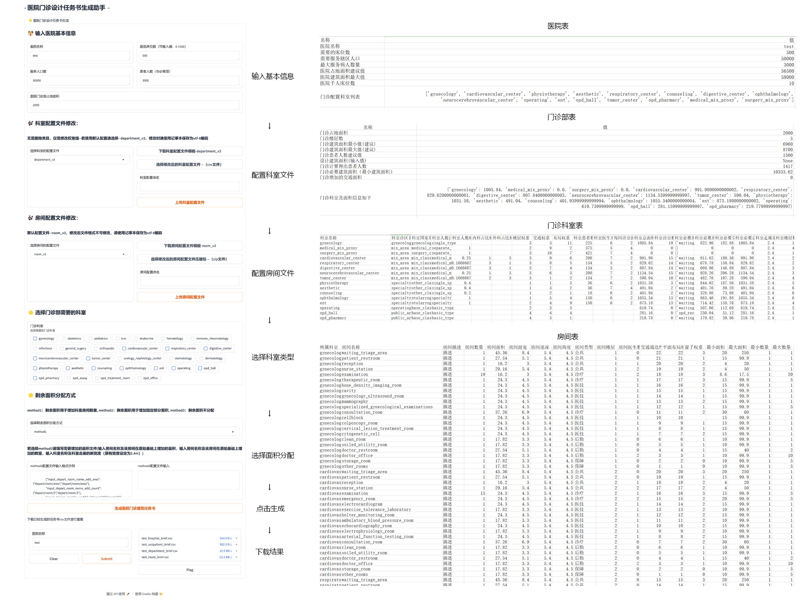

### Architectural Design Task Book for Hospital Outpatient Department
### 综合医院门诊建筑设计任务书生成

  

### 通过规则编码自动生成综合医院门诊部设计任务书，支持针对性的科室、房间文件配置

本项目可快速生成医院门诊建筑设计所需的数据、便于通医院建设、使用者（医生）快速进行”量“的沟通交流，为医院门诊建筑概念设计、方案设计阶段提质增效。

    1、提高建筑师、医院院方、建设者的前期沟通交流的工作效率
    2、降低医院建筑设计专业知识数据的获取、计算难度

本项目主要实现基于规则编码的医院门诊任务书生成，数据基于综合医院建筑设计规范、医院设计资料集进行编写。具体可分为以下几个阶段：

    一、配置文件读取
    二、医院相关计算
    三、医院门诊相关计算
    四、医院门诊科室相关计算
    五、医院门诊科室房间相关计算

### 文件
    cached: 缓存管理文件
    configs：配置文件存储文件夹
    data_cached: 用户生成的数据仓库
    entity：数据结构文件夹
    front：前端代码文件夹
    handler：各阶段计算函数文件夹
    img：项目图像
    main.py：入口函数
    webui.py：前端（gradio）启动函数

### 运行
    webui：python webui.py
    测试：python main.py

### 依赖
    gradio == 4.21.0

